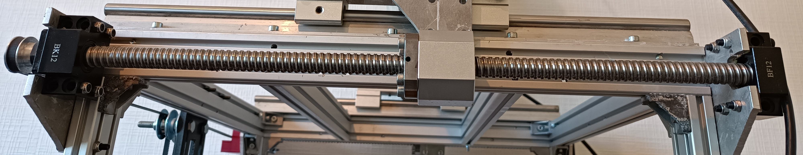
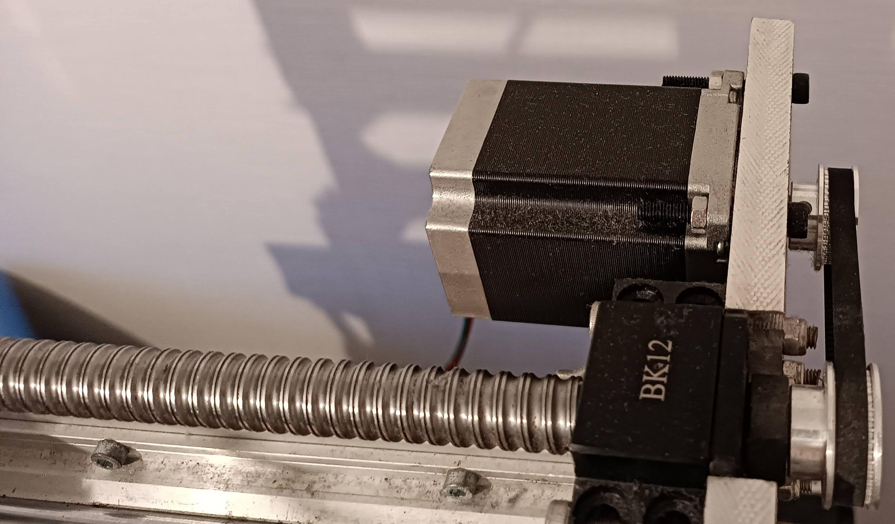
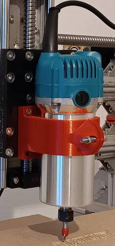
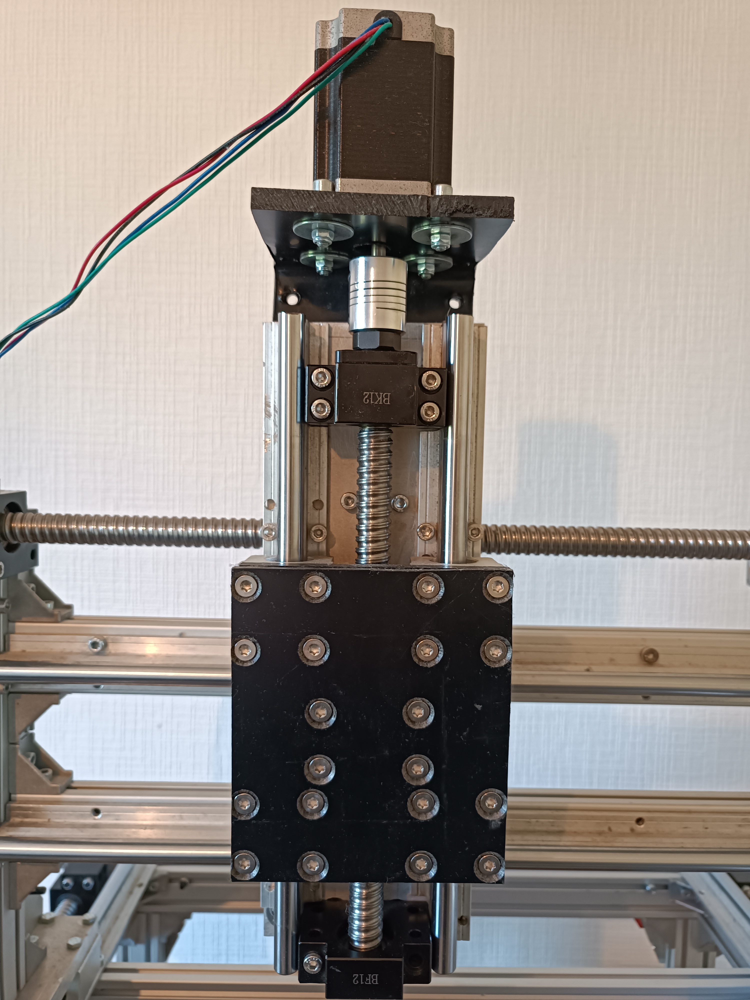
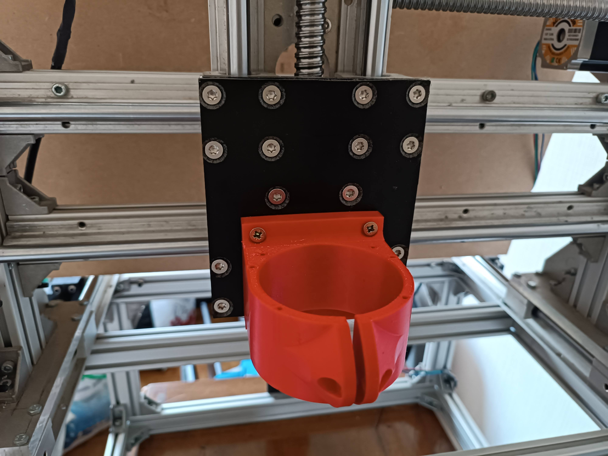
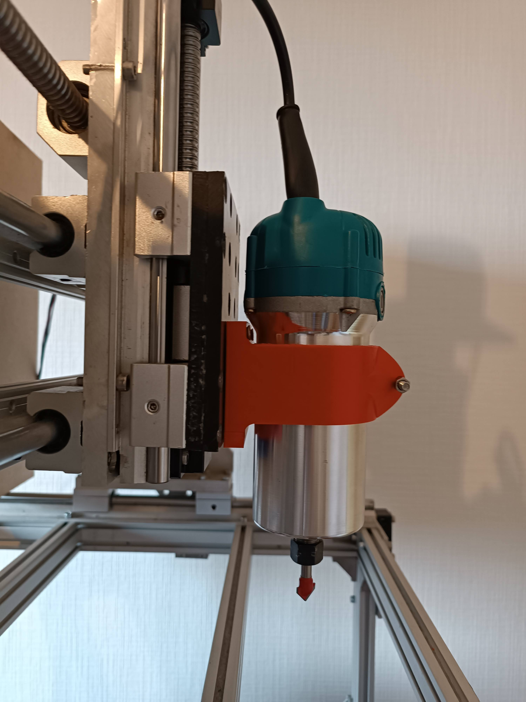

# CNC Milling Machine Build

## 1. Introduction
Welcome to the documentation of my homemade CNC milling machine project! This endeavor represents my journey in constructing a custom 3-axis CNC machine, designed to overcome the limitations of a cheap, entry-level CNC that I previously owned. That machine struggled with rigidity and power, especially when working on hard plastics and was unable to handle aluminum.

With those shortcomings in mind, I set out to create a more robust CNC milling machine, built primarily from aluminum profiles, supported linear rails, and powerful NEMA23 stepper motors. The aim was to design a machine capable of achieving better precision, increased rigidity, and the ability to mill tougher materials, including aluminum.

This repository documents the entire build process, from the initial technical choices to assembly, software setup, and calibration. The goal is to provide a detailed overview for anyone looking to understand or replicate the build, including all the challenges encountered and the solutions found along the way. I hope this serves as an informative guide for other makers and CNC enthusiasts looking to venture into building their own custom milling machine.

## 2. Key Features
- Big working area
- High rigidity
- Able to mill aluminum

## 3. Technical Choices
In constructing this CNC milling machine, I made a few crucial technical decisions intended to enhance overall performance, accuracy, and dependability compared to the previous beginner-level CNC I had. Down below, I'll outline the main components and systems selected for the project, along with the reasoning behind each choice.

### 3.1. Supported linear rails
One of the significant upgrades in this machine is the use of supported linear rails. Unlike the unsupported linear rods found on cheap CNC machines, which often suffer from bending under load, supported linear rails greatly improve the machine's rigidity. This extra support allows for higher accuracy and more consistent performance, especially during more demanding milling operations, such as working with aluminum. This was a crucial step to overcome the issues I had with my previous machine's instability.

### 3.1. Linear Screw Ball Bearings
To drive the movement along each axis, I opted for linear ball screws. Ball screws are well-known for their reduced backlash compared to standard lead screws, which translates to better precision in positioning. Furthermore, they are not backdrivable under load, meaning they maintain the machine's position without slipping when powered off. This adds to both the reliability and precision required for consistent, high-quality milling, particularly when dealing with hard materials.

### 3.2. NEMA23 Stepper Motors
The CNC machine uses NEMA23 stepper motors, which are a substantial upgrade over the smaller NEMA17 motors of my cheap machine. Stepper motors are ideal for CNC applications because they offer precise control over position, speed, and acceleration without requiring feedback from position sensors. They operate by moving in small, consistent steps, making them excellent for applications requiring accurate and repeatable movements.

The NEMA23 motors provide significantly more torque compared to NEMA17 motors, which is essential for driving heavier components and cutting tougher materials like aluminum. Their additional power helps achieve more reliable cutting speeds and forces without losing steps, ensuring better accuracy throughout the machining process. This makes them a perfect fit for ensuring stability and precision in a demanding milling setup.

### 3.3. Aluminum Profiles
The frame of the machine is constructed from aluminum profiles. This choice was motivated by the need for a material that is both lightweight and sufficiently strong to support the components and withstand the forces involved in milling. Aluminum profiles also offer flexibility in construction, with pre-made slots that make assembly straightforward and adjustable. Additionally, they are a cost-effective option, providing good strength while keeping the overall build cost reasonable.

### 3.4. Wood Router as Spindle
Instead of a specialized CNC spindle that can be expensive, I used a standard wood router as the spindle for this machine. The wood router was selected for its power and availability; it offers sufficient RPMs and torque to effectively mill not only wood and plastics but also aluminum, given proper speeds and feeds. 

While a wood router is not an ideal choice for intensive aluminum milling due to potential overheating and obviously because it was not manufactured for that purpose, it should be suitable for my build since I do not plan to use it intensively. For hobbyist-level projects, where the workload isn't constant or heavy, the wood router provides a good balance of performance and cost.

A wood router is designed with a special motor and bearings capable of handling significant perpendicular forces that occur during cutting. This makes it effective in dealing with side loads during milling operations, which is essential when used as a spindle. Although it lacks some of the finesse of dedicated CNC spindles, its capability to withstand lateral forces makes it a viable option for this build.

### 3.5. Linux CNC
For controlling the CNC machine, I chose LinuxCNC as the software platform. LinuxCNC is open-source, highly customizable, and has a robust feature set ideal for this kind of application. It offers the flexibility needed for tweaking control parameters and adapting to the specifics of a custom-built machine. Additionally, LinuxCNC has an active community that provides valuable support, making it an excellent choice for DIY CNC enthusiasts. Its real-time control capability ensures precise motion, which is critical for achieving high-quality milling results.

### 3.6. The computer
For controlling the CNC machine, I chose a DELL Optiplex 760 as the dedicated computer. This model is a popular choice for running LinuxCNC for several key reasons:

- **Physical Parallel Port on the Motherboard**: The Optiplex 760 includes a built-in physical parallel port, which is crucial for reliable communication with LinuxCNC when using software stepping. Unlike using PCI extension cards, the onboard parallel port provides lower latency and more consistent performance, reducing the chance of missed steps during operation. This makes it especially suitable for precise control in CNC applications.

- **Latency Performance**: The latency of the Optiplex 760 is stable and generally within acceptable limits for running LinuxCNC with a parallel port configuration. It has a latency of around 20 microseconds, which is near the upper limit for reliable software step generation, especially when running at higher step rates. While this might not be ideal for the most demanding applications, it is sufficient for the scope of my CNC build, which doesn't require extremely fast step rates. In a CNC control system, minimizing latency between software commands and hardware response is more important than having a fast processor because lower latency ensures precise and timely execution of each movement command, which is crucial for maintaining accuracy.

- **Compatibility and Power**: The Optiplex 760 is powered by an Intel Core 2 Duo processor, which provides more than enough computational power for LinuxCNC. This model is also one of the last in the Optiplex series to come with a physical parallel port, making it both powerful and compatible with older real-time Linux kernels that work well for LinuxCNC. Despite its age, this computer handles LinuxCNC tasks comfortably without performance bottlenecks.

By choosing the Optiplex 760, I ensured that the CNC setup had the necessary stability and compatibility for smooth operation, while keeping costs reasonable (30€ second hand). Its robust hardware, combined with the proven reliability of LinuxCNC, makes this a solid choice for hobbyist and entry-level CNC machine control.

## 4. The Build

### 4.1. X-Axis Assembly

### 4.2. Y-Axis Assembly

### 4.3. Z-Axis Assembly

### 4.4. Spindle Integration

### 4.5. Electronics Setup

## 5. Software Configuration

## 6. Testing and Calibration

## 7. Challenges and Solutions

## 8. Future Improvements
